<div align="center">

<!-- Animated SVG Header with JH Logo -->


# Hey there! I'm Joseph Hudak 👋

### 🚀 Full-Stack Developer | AI & UI Enthusiast 🚀

<div align="center">


</div>

</div>

---

## ✨ About Me

<div align="center">

```typescript
const joseph = {
  name: 'Joseph Hudak',
  location: 'Columbus, OH 🇺🇸',
  education: 'Computer Science & Engineering @ OSU',
  currentRole: 'Full-Stack Developer',
  interests: [
    'Full-Stack Development',
    'AI/ML Engineering',
    'UI/UX Design',
    'Mobile App Development'
  ],
  currently: 'Building DoubleDate, FadeAI & Physiq',
  motto: () => 'Ship early, iterate fast 🚀'
};
```

</div>

I'm a passionate developer and AI enthusiast currently pursuing **Computer Science & Engineering** at **The Ohio State University**. I love building products that combine elegant design with cutting-edge technology.

**Current Focus:**
- 🎨 Crafting beautiful, responsive user interfaces
- 🤖 Leveraging AI/ML in production applications
- 📱 Building cross-platform mobile apps with React Native & Expo
- 🌐 Developing scalable full-stack web applications
- 🔬 Experimenting with emerging frameworks and tools

---

## 🛠️ Tech Stack & Tools

<div align="center">

### Frontend Development


### Backend & Databases


### AI & Machine Learning


### DevOps & Cloud


</div>

---

## 🚀 Featured Projects

<div align="center">

<table>
  <tr>
    <td width="50%" valign="top">

### 💑 DoubleDate
*A revolutionary dating platform that brings couples together for exciting group experiences.*

<p align="left">
  • React Native & Expo<br>
  • Firebase Authentication & Firestore<br>
  • Real-time matching algorithms<br>
  • Beautiful, intuitive UI/UX
</p>


    </td>
    <td width="50%" valign="top">

### 🤖 FadeAI
*AI-powered image enhancement and manipulation platform using advanced neural networks.*

<p align="left">
  • Next.js 14 App Router<br>
  • OpenAI & Stable Diffusion<br>
  • Real-time processing<br>
  • Beautiful dashboard UI
</p>


    </td>
  </tr>
  <tr>
    <td colspan="2" width="100%" valign="top">

### 💪 Physiq
*Your personal fitness companion with AI-driven workout recommendations and progress tracking.*

<p align="left">
  • React & TypeScript<br>
  • AI-powered recommendations<br>
  • Progress visualization<br>
  • Social features & challenges
</p>


    </td>
  </tr>
</table>

</div>

---

## 📊 GitHub Stats & Activity

<div align="center">


</div>

<div align="center">


</div>

---

## 🤝 Connect With Me

<div align="center">

[](https://linkedin.com/in/yourprofile)
[](https://github.com/yourusername)
[](https://twitter.com/yourhandle)
[](https://yourportfolio.com)
[](mailto:your.email@example.com)

</div>

---

<div align="center">

### 💡 Building the future, one commit at a time.


⭐ **Star my repositories if you find something interesting!**

<!-- Repository card -->
[](https://github.com/yourusername/yourrepo)

</div>
